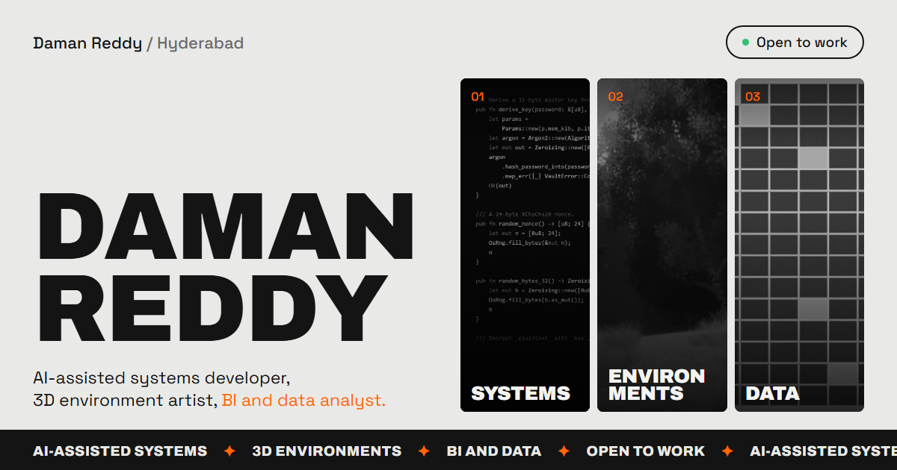

# Daman Reddy — Portfolio

Portfolio of a creative technologist working in three crafts: **AI-assisted systems developer**, **3D environment artist** and **BI and data analyst**. Twenty projects, one standard: real numbers only.

**Live:** [damanjz.github.io/portfolio](https://damanjz.github.io/portfolio/)



---

## What it is

- **Landing (`/`)** — a dossier. Who on the left: name, a short bio, the three crafts with one real stat each, and contact. Every project on the right, in three columns of tiles that drift slowly. Hover (or tab to) a craft and its work lights up on the wall; hover a work and its craft lights up and a line reads out what it is. A pause button stops the wall.
- **Craft pages** — [`/systems/`](https://damanjz.github.io/portfolio/systems/), [`/art/`](https://damanjz.github.io/portfolio/art/), [`/data/`](https://damanjz.github.io/portfolio/data/): the pitch, the numbers, how the work is done, then every project.
- **Project pages** — `/projects/<slug>/`: problem, build, measurement and findings, decisions, screenshots or renders, and links to source, live dashboards and case-study PDFs.
- **Resume** — [`/resume/`](https://damanjz.github.io/portfolio/resume/) with a PDF download.

Art and screenshots sit in black and white and come to colour on hover. Data and software projects without a strong screenshot are drawn as a **pipeline card** instead: what goes in, the core in orange, what comes out, and four measured numbers.

## Principles

- **Zero external requests.** Fonts are self-hosted at build time, images are committed WebP with 800/1400 px copies, and YouTube embeds (nocookie) load only on click.
- **Static and local-first.** No backend, no database, no analytics. A plain static export.
- **Real metrics only.** Every number on the site comes from the project it describes.
- **One source of truth.** All copy, projects, stats and pipeline cards live in `src/content.ts`; components only lay it out.
- **Works for everyone.** Keyboard parity for every hover, a pause control for motion, reduced-motion respected, readable without JavaScript.

## Tech

| | |
|---|---|
| Framework | Next.js 16 (App Router) · React 19 |
| Language | TypeScript |
| Styling | Plain CSS (`src/app/globals.css`), container-query sized cards |
| Motion | One shared layer: Lenis scroll, IntersectionObserver reveals, a single rAF loop for the wall |
| Type | Archivo 900 caps for display, Space Grotesk for text (self-hosted via `next/font`) |
| Output | Static export (`output: "export"`) to GitHub Pages |

## Project structure

```
src/
├── app/
│   ├── page.tsx                # landing (the dossier)
│   ├── [track]/page.tsx        # craft pages: systems, art, data
│   ├── projects/[slug]/        # one page per project
│   ├── resume/page.tsx         # resume page
│   ├── not-found.tsx           # custom 404 (out/404.html)
│   ├── sitemap.ts · robots.ts  # SEO routes
│   └── structured-data.tsx     # Person JSON-LD
├── components/
│   ├── Dossier.tsx             # landing: intro, crafts, drifting wall
│   ├── DataCard.tsx            # pipeline card
│   ├── WorkCard.tsx            # project card on craft pages
│   ├── Motion.tsx              # the one motion layer
│   └── …                       # header, transitions, cursor, galleries
├── lib/asset.ts                # base-path aware asset URLs and srcset
└── content.ts                  # SINGLE SOURCE OF TRUTH
scripts/
├── sizes.mjs                   # 800/1400 px WebP copies + manifest
└── og.mjs                      # renders the share image (public/og.png)
```

## Run it locally

```bash
npm ci
npm run dev
```

Open [localhost:3000](http://localhost:3000).

```bash
npm run build
```

Writes the static site to `out/`. Check changes there rather than on the dev server.

After adding images, run `node scripts/sizes.mjs`. To refresh the share image after a build, run `node scripts/og.mjs` with `CHROME` set to a Chromium executable.

## Deploy

Pushing to `main` runs GitHub Actions (`.github/workflows/deploy.yml`), which builds and publishes to GitHub Pages in about a minute. The site lives under the `/portfolio` base path; the workflow sets `NEXT_PUBLIC_BASE_PATH` so every asset URL resolves.

## SEO and machine-readability

Per-page canonical, Open Graph and Twitter metadata, a site-wide `Person` schema, `sitemap.xml`, `robots.txt`, a semantic heading outline, and an [`llms.txt`](https://damanjz.github.io/portfolio/llms.txt) summary for language models.

## Changelog

See [CHANGELOG.md](./CHANGELOG.md).

## License

The **source code** is [MIT-licensed](./LICENSE). The **content** (project copy, 3D art, images, video, and Daman's name and identity) is **All Rights Reserved** and not licensed for reuse. See [LICENSE](./LICENSE) for the full terms.

---

© Daman Reddy · [github.com/damanjz](https://github.com/damanjz) · [artstation.com/damanpsd](https://www.artstation.com/damanpsd)
